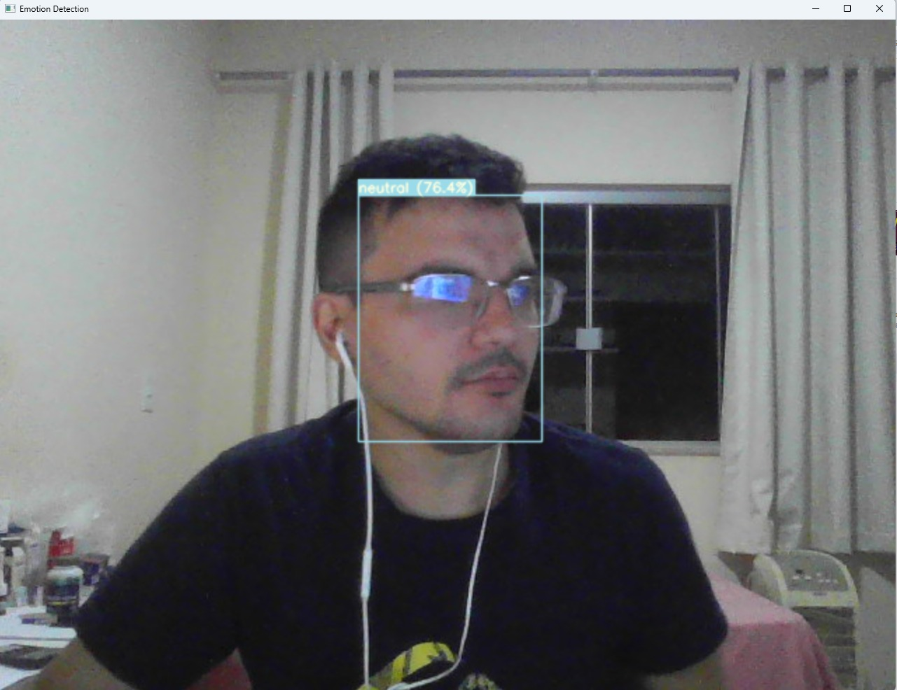

# 🧠 Detecção de Emoções em Tempo Real: YOLO-V5 + RepVGG

## Introdução
Este projeto consiste em um sistema de **Detecção e Classificação de Emoções Faciais em Tempo Real** utilizando uma arquitetura robusta baseada em **Visão Computacional** e **Deep Learning (PyTorch)**.  
O objetivo é identificar faces em um vídeo ou imagem e classificar a emoção expressa em uma das **8 categorias básicas**.

## 🏗️ Arquitetura do Modelo
O sistema opera em duas etapas sequenciais para garantir alta precisão e velocidade:

### 1. Detecção Facial (YOLO-V5)
Utiliza uma versão otimizada do **YOLO-V5 (You Only Look Once)**, treinado no massivo dataset **WIDER FACE**, para identificar e gerar caixas delimitadoras (*bounding boxes*) precisas para cada rosto presente na cena.

### 2. Classificação de Emoções (RepVGG)
A região da face detectada é então alimentada em uma rede neural **RepVGG**.  
Este modelo, conhecido por sua alta eficiência e desempenho em tarefas de classificação, foi treinado no dataset **AffectNet** para classificar a emoção.

## 😃 Emoções Detectadas
O modelo classifica **8 expressões faciais primárias**:

- 😡 anger (Raiva)  
- 😒 contempt (Desprezo)  
- 🤮 disgust (Nojo)  
- 😨 fear (Medo)  
- 😄 happy (Felicidade)  
- 😐 neutral (Neutro)  
- 😢 sad (Tristeza)  
- 😮 surprise (Surpresa)  

## 🛠️ Configuração do Ambiente
Este projeto requer **Python 3.7+** e as bibliotecas listadas no `requirements.txt`.

### 1. Clonar o Repositório
```bash
git clone https://github.com/luizfernandodag/emotion-detection-pytorch.git
cd emotion-detection-pytorch

```

### 2. Instalação de Dependências

#### Usando pip (Recomendado)
```bash
# Crie um ambiente virtual (opcional, mas boa prática)
python -m venv venv
source venv/bin/activate  # Linux/macOS
# venv\Scripts\activate # Windows

# Instale as dependências
pip install -r requirements.txt
```

#### Usando conda (Alternativa)
```bash
conda env create -f env.yaml
conda activate yolov5
```

### 3. Pesos do Modelo (Weights)
O projeto está configurado para **baixar automaticamente os pesos pré-treinados** na primeira execução.

## ▶️ Como Rodar o Projeto
O script principal é o `main.py`, que aceita a fonte (`source`) da sua entrada de vídeo/imagem.

### 1. Detecção em Tempo Real (Webcam)
```bash
python main.py --source 0
```

### 2. Detecção em Arquivo de Vídeo ou Imagem
```bash
python main.py --source /caminho/para/seu/video_ou_imagem.mp4
```

## ⚙️ Opções Adicionais (Argumentos)

| Argumento        | Descrição                                              | Exemplo              |
|------------------|----------------------------------------------------------|----------------------|
| `--source`       | Fonte da inferência (câmera, vídeo, imagem)             | 0 ou video.mp4       |
| `--conf-thres`   | Limite de confiança da detecção facial (0.0 a 1.0)      | 0.45                 |
| `--device`       | Dispositivo de hardware para inferência                 | cpu ou 0 (CUDA)      |
| `--hide-img`     | Não exibir a janela de resultados                       | —                    |
| `--output-path`  | Salvar os resultados em um diretório                    | ./saida_analisada    |

## 📸 Demonstração da Aplicação




## ☁️ Link para Teste Online (AWS)
A fazer 
🔗 **Web App:**  
```
A fazer 
```

## 📄 Sobre o Autor
Este projeto foi desenvolvido por **[LUIZ FERNANDO DE ANDRADE GADELHA]** como parte do curso de Engenharia de Visão Computacional.
- LinkedIn:  luiz-gadelha
- Artigo publicado: A FAZER
